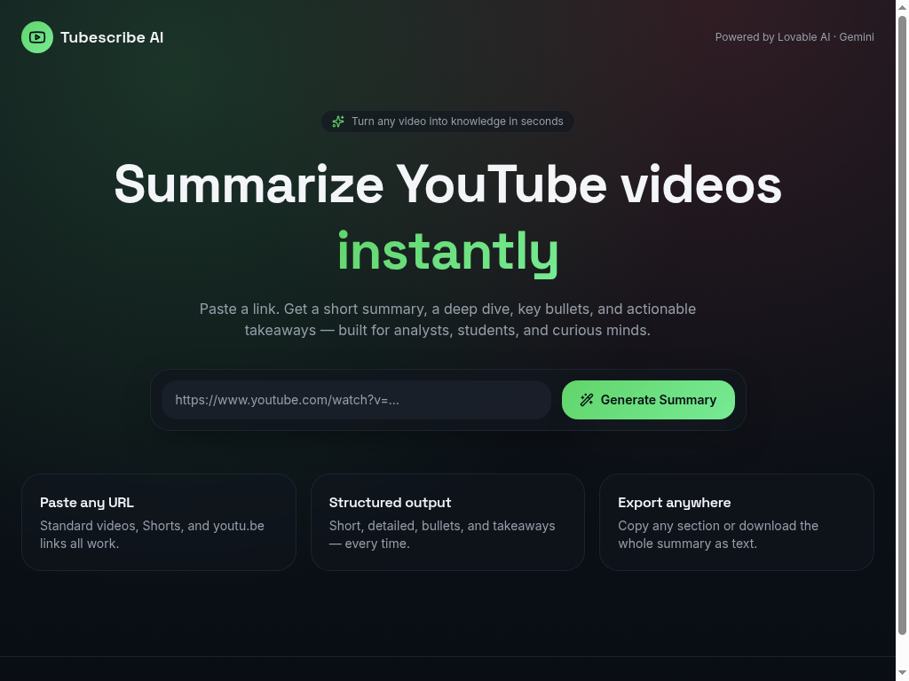
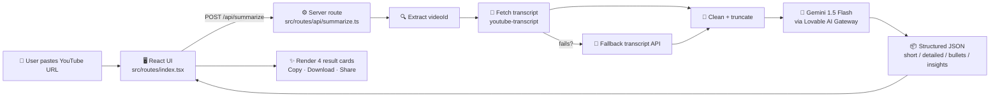
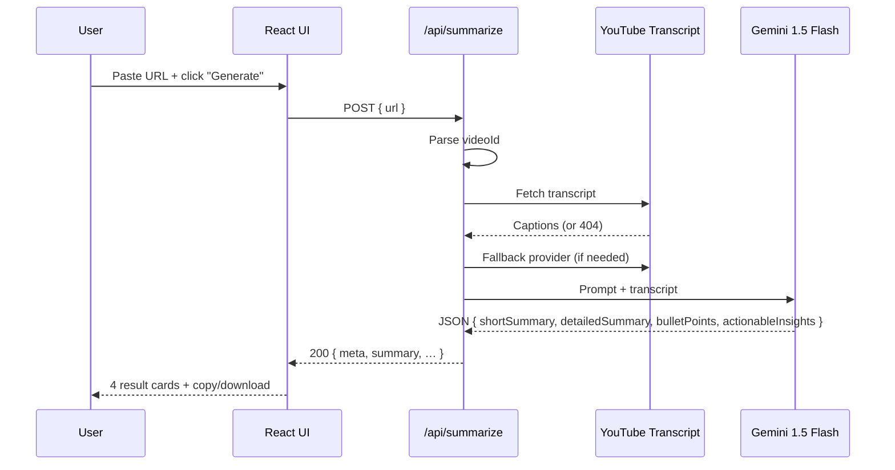

# 🎬 Tubescribe AI — YouTube AI Summarizer

> Paste any YouTube link → get a **short summary**, a **detailed summary**, **key bullet points**, and **actionable insights** in seconds.

Built for analysts, students, researchers, and anyone who watches more videos than they have time for.



🔗 **Live demo:** https://tubescriberr.lovable.app

---

## ✨ What is this?

**Tubescribe AI** turns long YouTube videos into structured, scannable knowledge.
Instead of watching a 45‑minute video, you get four neatly organized blocks of insight that you can copy, share, or download as a `.txt` file.

### Why use it?
- ⏱ **Save hours of watch time** — get the gist in under 30 seconds.
- 📊 **Business‑analyst ready** — structured output (short, detailed, bullets, takeaways) that drops straight into reports or notes.
- 🎓 **Study aid** — summarize lectures, podcasts, and tutorials.
- 🧠 **Research** — quickly triage which videos are worth a full watch.
- 📥 **Export anywhere** — copy any section or download the full summary.

---

## 🧩 Features

| Feature | Description |
|---|---|
| 🔗 Universal URL support | `youtube.com/watch?v=…`, `youtu.be/…`, Shorts |
| ✂️ Short Summary | A 3–4 line TL;DR |
| 📖 Detailed Summary | Multi‑paragraph deep dive |
| 🎯 Key Bullet Points | 3–12 concise highlights |
| 🚀 Actionable Insights | Practical takeaways you can act on |
| 📋 One‑click copy | Copy any individual section |
| 📥 Download `.txt` | Export the full structured summary |
| 🌗 Modern dark UI | Responsive, glassy, gradient design |

---

## 🏗 Tech Stack

- **Frontend:** React 19 + TanStack Start (Vite 7), Tailwind CSS v4
- **Backend:** TanStack Start server routes (TypeScript, edge runtime)
- **Transcripts:** `youtube-transcript` + resilient fallback provider
- **AI model:** **Google Gemini 1.5 Flash** via the Lovable AI Gateway
- **Hosting:** Lovable Cloud (Cloudflare Workers)

> 💡 The original brief asked for Flask + Python. This implementation keeps the **same architecture and contract** (REST endpoint → transcript → Gemini → structured JSON) but runs on a modern edge stack so it deploys in one click. A downloadable Flask version of the same logic is also available on request.

---

## 🔄 How it works (flowchart)



### Sequence: a single request



---

## 🚀 Getting started (local dev)

```bash
# 1. Install
bun install

# 2. Run the dev server
bun run dev

# 3. Open
# → http://localhost:5173
```

The Lovable AI Gateway key is auto‑provisioned in the Lovable environment — no `.env` setup needed when running inside Lovable. For self‑hosting, set:

```env
LOVABLE_API_KEY=your_gateway_key
```

---

## 📁 Project structure

```
youtube-summarizer/
├── src/
│   ├── routes/
│   │   ├── index.tsx              # Landing page + UI
│   │   ├── __root.tsx             # Root layout
│   │   └── api/
│   │       └── summarize.ts       # POST /api/summarize  (transcript + AI)
│   ├── lib/
│   │   └── ai-gateway.ts          # Lovable AI Gateway client
│   ├── styles.css                 # Design tokens (oklch) + Tailwind v4
│   └── router.tsx
├── docs/
│   └── images/                    # README screenshots
├── package.json
└── README.md
```

---

## 🔌 API contract

`POST /api/summarize`

```json
{ "url": "https://youtu.be/xZFN36vx9fc" }
```

**Response**

```json
{
  "videoId": "xZFN36vx9fc",
  "meta": { "title": "…", "author": "…", "thumbnail": "https://…" },
  "truncated": false,
  "shortSummary": "…",
  "detailedSummary": "…",
  "bulletPoints": ["…", "…"],
  "actionableInsights": ["…", "…"]
}
```

---

## 🧠 Working — step by step

1. **URL parsing** — supports `watch?v=`, `youtu.be/`, `/shorts/`, and `/embed/`.
2. **Transcript retrieval** — primary path uses `youtube-transcript`; if YouTube blocks the request, an authenticated fallback provider is used.
3. **Sanitization** — HTML entities are decoded and excessive whitespace is collapsed. Transcripts longer than the model's safe window are truncated (and the UI displays a “truncated” note).
4. **Prompting** — a single Gemini 1.5 Flash call returns a strict JSON object with four fields. The handler validates and reshapes it before responding.
5. **Rendering** — the UI presents four cards: Short, Detailed, Bullets, Insights — each with a one‑click copy button, plus a full `.txt` export.

---

## 🛣 Roadmap

- 🌍 Multi‑language summaries
- 📑 PDF export
- 🔖 Save & revisit history (Lovable Cloud DB)
- 🧵 Chapter‑by‑chapter breakdown with timestamps
- 🗣 Q&A chat on top of the transcript

---

## 📜 License

MIT — free for personal and commercial use. Built with ❤️ on [Lovable](https://lovable.dev).
